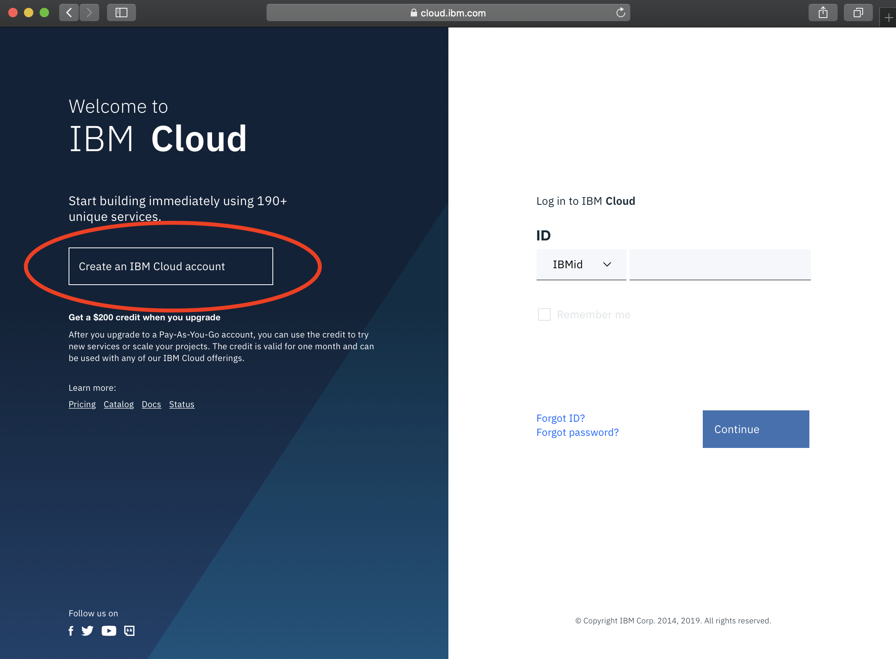

# Create IBM Cloud Account

1. Go to [IBM Cloud](https://cloud.ibm.com)
2. Create IBMId/Cloud account. Click on the highlighted button on the left

3. Fill in the account details and click on the create button at the botoom

4. Check for your email from IBM Cloud

5. Sign in with the newly created IBM id

6. Welcome to [IBM Cloud](https://cloud.ibm.com)

