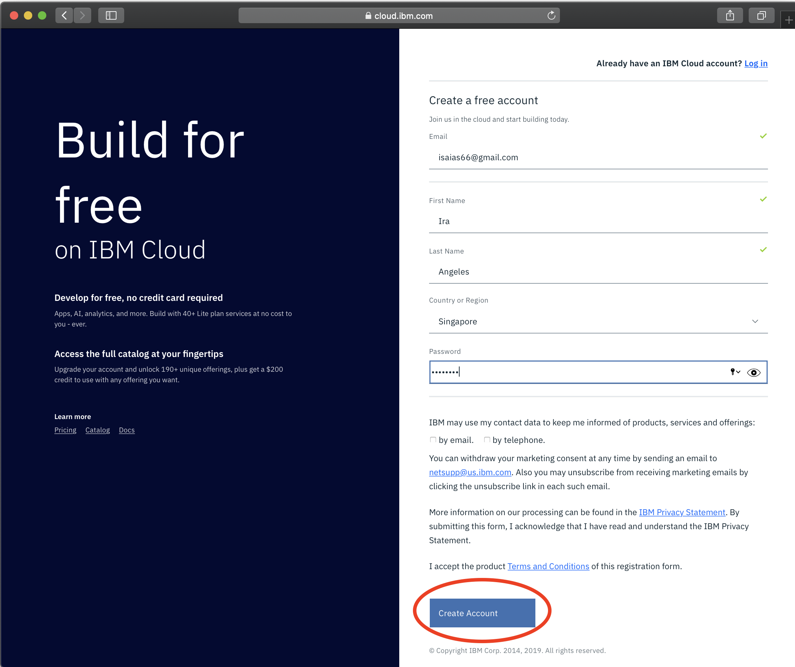
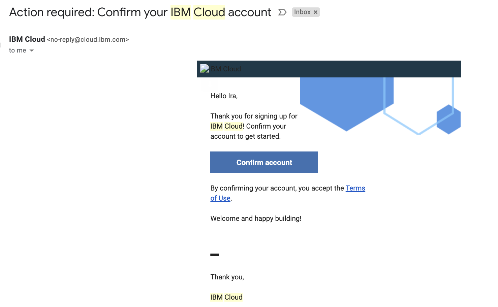
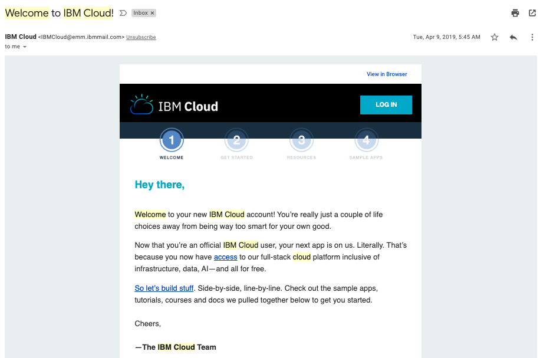
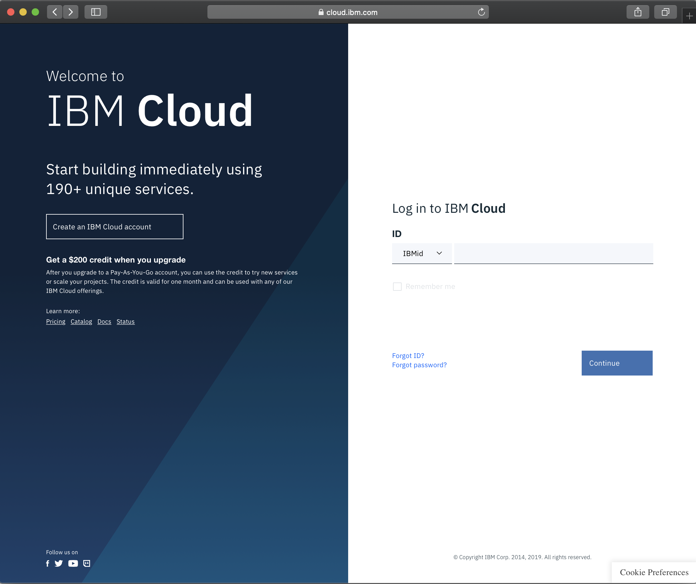
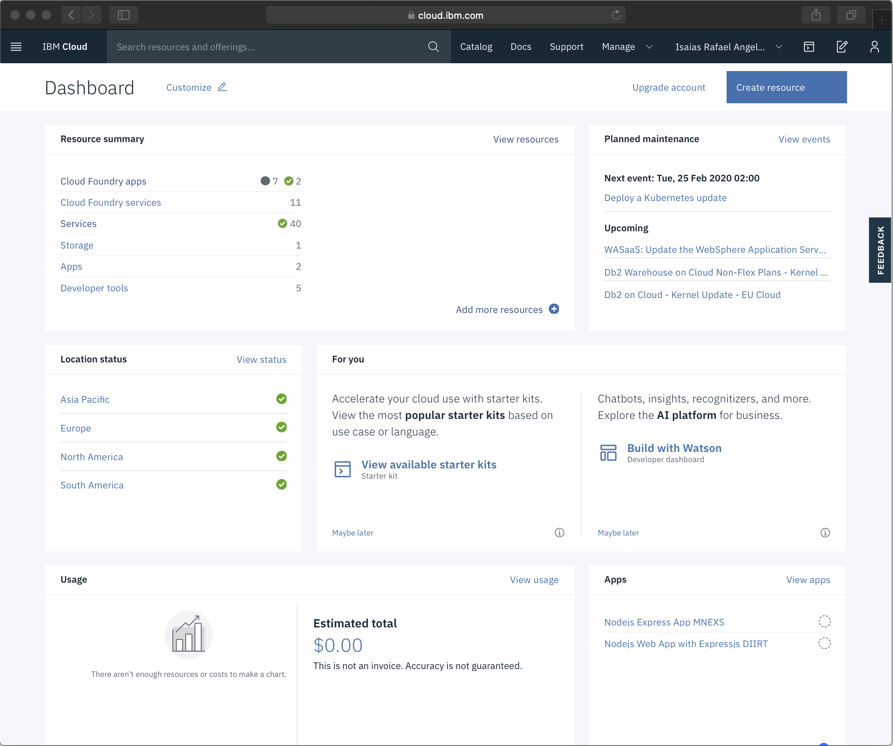

# Create IBMId and Cloud Account

> * Images are for reference and may differ from the current version of the user interface (UI)
> * Please check this document regularly for updates

1. Proceed to [IBM Cloud registration site](https://ibm.biz/BdqHxa)

2. Fill in the account details and click on the create button at the botoom (account creation)

 

3. Check your email from IBM Cloud team

 

4. You will receive a Welcome email from IBM Cloud team

 

5. Log in with the created IBM id (use the same email address provided in account creation step)

 

6. Welcome to [IBM Cloud](https://cloud.ibm.com)

 

